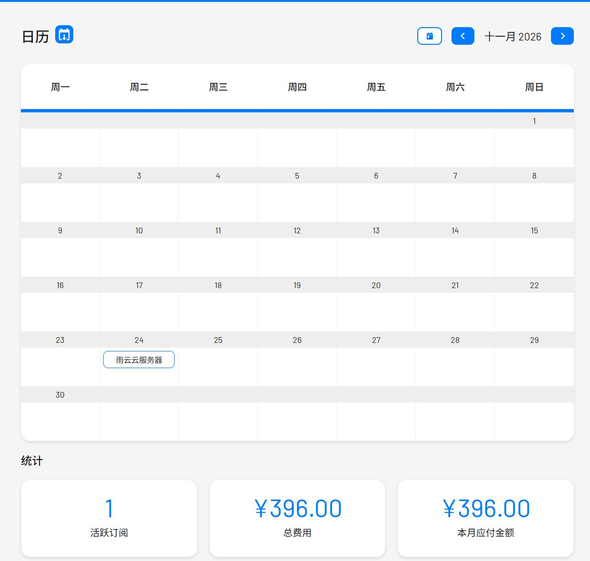
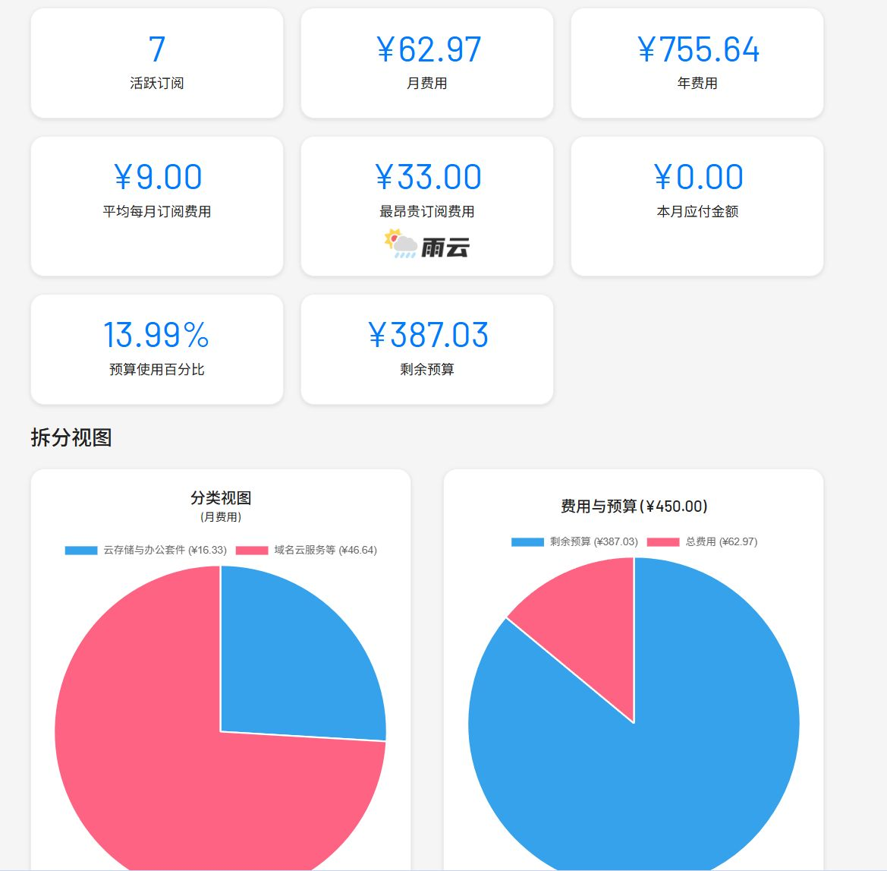
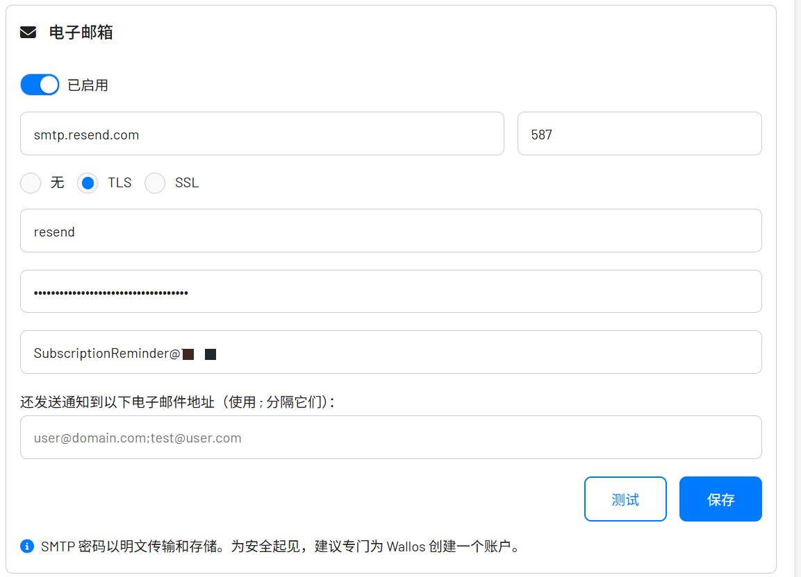

随着订阅的服务越来越多，我总是会在想不到的时候收到"续费通知"，网盘会员，手机号，域名，云服务器。我曾经购买过小厂的云服务器，快过期的时候给我发送了续费邮件，但是被归到垃圾箱分类了。云服务器过期，数据也没了。我发觉有一个工具来管理自己的订阅是很重要的，另外我也不喜欢绑卡自动续费。
\# 简单介绍
**Wallos**是一款开源的个人订阅管理工具，[官网](https://wallosapp.com/)，[github](https://github.com/ellite/Wallos)。对了，官方提供了一个[体验demo](https://demo.wallosapp.com/)

> Wallos is a powerful, open-source, and self-hostable web application designed to empower you in managing your finances with ease. Say goodbye to complicated spreadsheets and expensive financial software -- Wallos simplifies the process of tracking expenses and helps you gain better control over your financial life.

译文：

> Wallos 是一款强大、开源且自托管的网络应用程序，旨在帮助您轻松管理财务。告别复杂的电子表格和昂贵的财务软件------Wallos 简化了记录开支的过程，帮助您更好地掌控自己的财务生活。

他不仅可以出色的满足我们管理订阅的需求，中文支持完善，并且提供了[api接口](https://api.wallosapp.com/)，意味着我们也可以自己开发(vibe)一些工具来更好的使用。我就在想做一块可以看日历，任务清单，账单，订阅服务的墨水屏。

网页截图：






因为我还没怎么用，订阅的东西没用完整添加。

# 安装

## 安装要求：

- 直接运行：需要你能够运行nginx网页服务器和php8.3 (摘自github)
- docker容器化部署(推荐)：x86电脑/服务器，arm64(仅测试了Apple M4 电视盒子能否支持无法保证)

## docker compose部署

``` shell
mkdir wallos #创建一个文件夹用于存储wallos数据
cd wallos
vim docker-compose.yml #创建并编辑docker-compose.yml文件
```

进入vim后键入`i`，然后粘贴下面的内容，`8282`是你想暴露的端口。

``` yml
services:
  wallos:  # 定义一个名为 "wallos" 的服务
    container_name: wallos  # 指定容器运行时的名称为 "wallos"，便于识别和管理
    image: bellamy/wallos:latest  # 使用的镜像名称及标签：从 Docker Hub 拉取 bellamy/wallos 的最新版本
    ports:
      - "8282:80/tcp"  # 端口映射：将宿主机的 8282 端口映射到容器的 80 端口（TCP协议），用于访问 Web 界面
    environment:
      TZ: "Asia/Shanghai"  # 设置容器内的时区环境变量为上海时区，确保时间显示正确
    # Volumes 用于在容器升级或重启时持久化保存数据
    volumes:
      - './db:/var/www/html/db'
      - './logos:/var/www/html/images/uploads/logos'
    restart: unless-stopped  # 容器重启策略：除非手动停止，否则在 Docker 启动时自动运行该容器
```

按下`Esc`,键入`:wq`

执行。

``` shell
sudo docker compose up -d   #如果权限组配置了可以不加sudo
```

访问 https://serverip:8282

# 使用

大多数基本操作我就不介绍了，很容易摸清楚，官方建议注册一个[Fixer API](https://fixer.io/#pricing_plan)用于获取汇率并自动计算，不过我不需要就没弄了而且注册还有填一堆信息。

这里讲下我的邮箱设置，我之前用网易邮箱做wordpress博客的通知邮箱，后来被网易停用了说我发广告，所有我找了个别的方案: [Resend](https://resend.com/)。可以参考[这个视频](https://www.bilibili.com/video/BV1JS411A7se/)配置下，这样就有了自己的私人邮箱，然后填入wallos



    smtp.resend.com
    587
    resend
    you_resend_key
    SubscriptionReminder@you_email.com

这样你就可以收到邮件提醒了。
