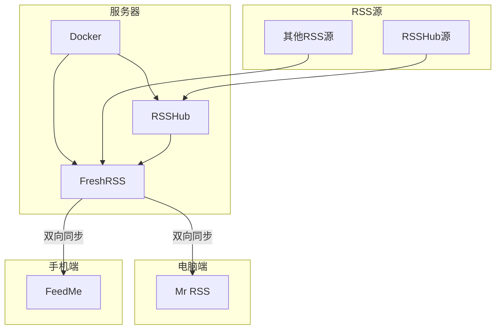

This website is built with the **Astro** framework using the [Mizuki](https://github.com/matsuzaka-yuki/mizuki) theme.

::github{repo="matsuzaka-yuki/Mizuki"}

太赶了，先上线试试，打算静态博客和动态博客一起做。

```mermaid
graph TD
    subgraph A [服务器]
        direction TB
        A1[Docker] --> A2[RSSHub]
        A1 --> A3[FreshRSS]
    end

    subgraph B [电脑端]
        B1[Mr RSS]
    end

    subgraph C [手机端]
        C1[FeedMe]
    end

    subgraph D [RSS源]
        D1[RSSHub源]
        D2[其他RSS源]
    end

    D1 --> A2
    D2 --> A3
    A2 --> A3
    
    A3 -- 双向同步 --> B1
    A3 -- 双向同步 --> C1

```
